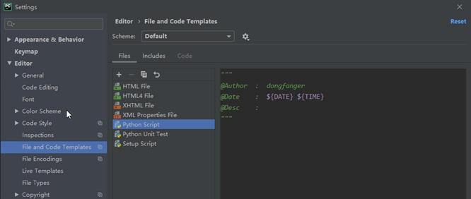
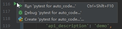
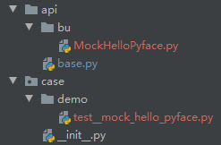
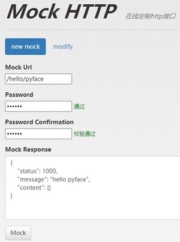
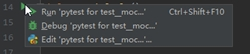
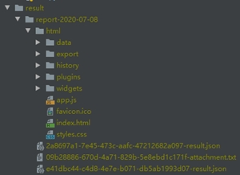
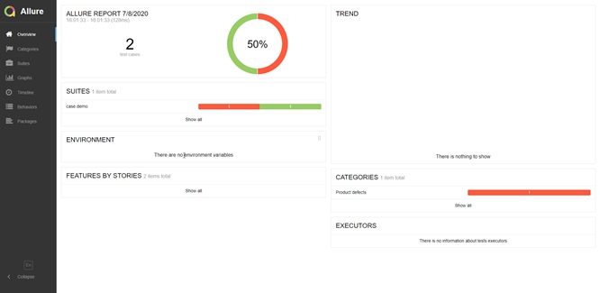

# pyface

一款JMeter设计灵感的RESTful API测试框架。

[TOC]

# 安装

1. 下载源码

    ```shell
    git clone git@github.com:dongfanger/pyface.git
    ```

2. 安装python虚拟环境（推荐，非必须）

    新建文件夹venv，cmd命令，

    ```shell
    >python -m venv pyface
    >cd pyface
    >cd Scripts
    >activate.bat
    ```

    激活虚拟环境后，cmd会加上前缀，

    ```
    (pyface)>
    ```

    此后执行pip install就可以安装到虚拟环境下。

    虚拟环境的好处是可以避免python的site-packages臃肿，分而治之。

3. 安装package

   依赖的package已经通过`pip freeze > requirement.txt`，生成到requirement.txt文件中了。
   
   ```
   allure-pytest
   allure-python-commons
   numpy
   pandas
   PyMySQL
   requests
   SQLAlchemy
   texttable
   urllib3
   ```
   
   推荐使用国内镜像安装，并设置默认超时5分钟，
   
   ```
   pip --default-timeout=300 install -i https://pypi.tuna.tsinghua.edu.cn/simple package_name
   ```
   
   批量安装requirement.txt中的package需要加上`-r`参数，
   
   ```
   pip --default-timeout=300 install -i https://pypi.tuna.tsinghua.edu.cn/simple -r requirement.txt
   ```
   
   以下是我安装后的结果，
   
   
   
4. 设置Default test runner为pytest

   

5. 设置Code Templates（推荐，非必须）

   ```
   """
   @Author  :  dongfanger
   @Date    :  ${DATE} ${TIME}
   @Desc    :  
   """
   ```


   

6. allure

   https://github.com/allure-framework/allure2/releases/

   下载解压后，将bin目录绝对路径添加到系统变量/虚拟环境变量。

   系统变量windows添加到Path。

   虚拟环境变量添加到venv\pyface\Scripts\activate.bat中，27行，

   ```
   set PATH=%VIRTUAL_ENV%\Scripts;%PATH%;D:\downloads\allure-commandline-2.13.5\allure-2.13.5\bin
   ```

7. 备注，python、pycharm、jdk网上搜索下载安装即可。

# 使用

1. 自动生成api和case代码

   在auto_code.py文件中，输入api信息等，

   ```
       author = 'dongfanger'  # 编码人员
       api_info = {
           'api_description': 'demo',  # api描述
           'api_dir': 'bu',  # api存放目录，相对pyface/api/路径，推荐按business unit来划分
           'uri': '/mock/hello/pyface',  # api uri
           'body': """{}""",  # 参数
           'case_dir': 'demo',  # case存放目录，相对pyface/case/路径
       }
   ```

   点击运行，

   

   生成api和case文件，

   

2. 在线mock（演示，非必须）

   http://www.mockhttp.cn/，打开后mock一个http接口，密码随意如123456，

   ```
   /hello/pyface
   
   {
       "status": 1000,
       "message": "hello pyface",
       "content": {}
   }
   ```
   
   
3. 配置环境变量

   在data\env.py文件中，修改test_url为http://www.mockhttp.cn，
   
   ```
   class Qa:
       test_url = 'http://www.mockhttp.cn'
       headers = {"Content-Type": "application/json"}
       # dao_x = Dao('host:port',
       #             "username",
       #             "password")
   ```

4. 运行

   在pytest_allure.py文件中，选择运行的环境，这里选择上一步配置的Qa，

   ```
   # choose environment name
   vars_ = Qa
   ```

   有2种运行方式，

   一是基于IDE运行，如这里我只运行test\_mock\_hello\_pyface.py里面的test\_default()，

   

   运行结果，

   ```
   -------------------------------- live log call --------------------------------
   [2020-07-08 15:28:42] requesting
   [2020-07-08 15:28:42] url
   http://www.mockhttp.cn//mock/hello/pyface
   [2020-07-08 15:28:42] headers
   {"Content-Type": "application/json"}
   [2020-07-08 15:28:42] json
   {}
   [2020-07-08 15:28:42] response
   {
       "status": 1000,
       "message": "hello pyface",
       "content": {}
   }
   PASSED                                                                   [100%]
   ```

   二是使用pytest+allure批量运行，在pytest_allure.py，可以选择执行目录，如下是执行case/目录下所有test，

   ```
   if __name__ == '__main__':
       base_dir = os.path.dirname(os.path.abspath(__file__))
       result_report_dir = os.path.join(result_dir, 'report-' + current_time('date'))
       if os.path.exists(result_report_dir):
           shutil.rmtree(result_report_dir)
       os.makedirs(result_report_dir)
   
       # input the directory to run pytest
       run_dir = os.path.join(base_dir, 'case')
       
       os.system(f'pytest -v {run_dir} --alluredir {result_report_dir}')
   ```

   运行后会生成allure测试报告，

   

   index.html右键选择chrome打开。

   也可以选择运行完后自动打开测试报告，在pytest_allure.py文件中，

   ```
   # open allure report after test
   open_allure_report = 1
   ```

   修改test\_mock\_hello\_pyface.py，

   ```python
   #!/usr/bin/python
   # encoding=utf-8
   
   """
   @Author :  dongfanger
   @Date   :  2020-07-08 14:15:47
   @Desc   : 
   """

   from api.bu.MockHelloPyface import MockHelloPyface
   from pytest_allure import vars_
   
   
   def test_default():
       x = MockHelloPyface()
       x.load().send()
   
   
   def test():
       assert 1 == 2
   ```
   
   测试报告长这样，
   
   


更多介绍请见[wiki](https://github.com/dongfanger/pyface/wiki/介绍)。


